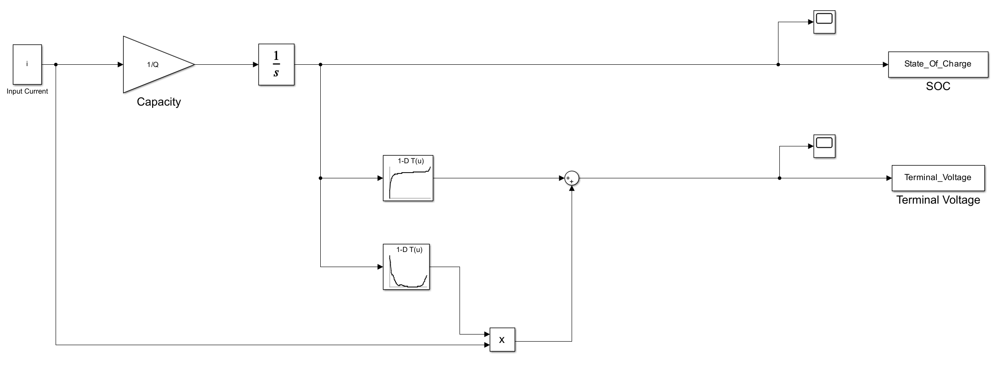
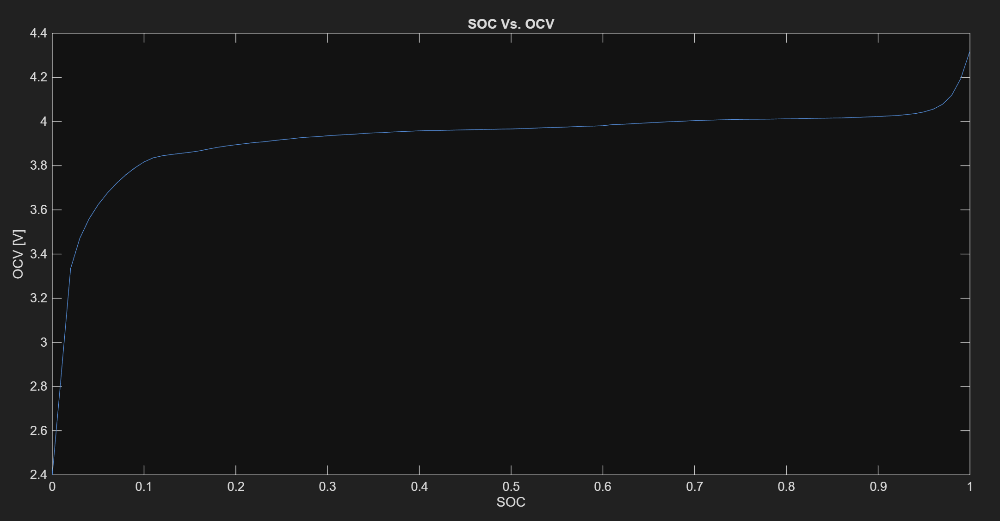
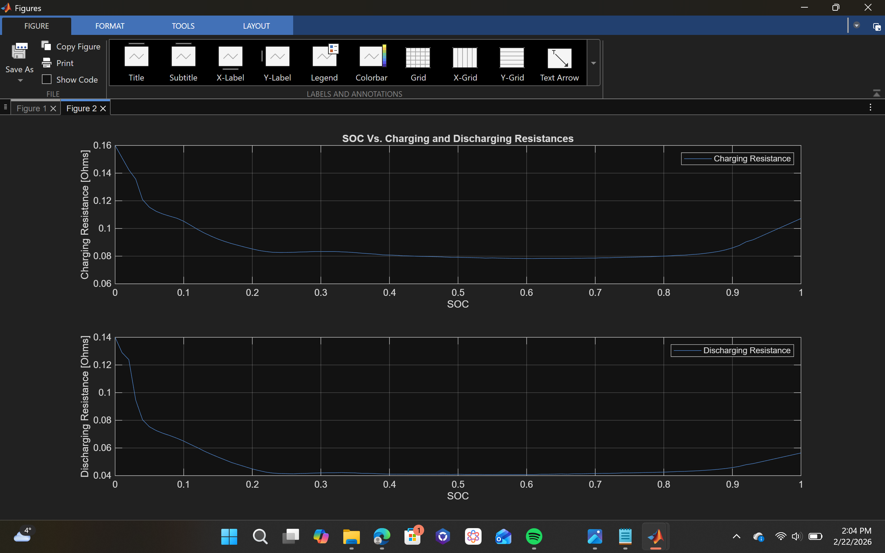

# Lithium-Ion Battery Model in Simulink

This project contains a mathematical model of a Lithium-Ion battery cell developed using MATLAB/Simulink. The model simulates battery behavior during charging and discharging, which is essential for developing a Battery Management System (BMS).

## Project Overview

- **Battery Modeling:** I used an equivalent circuit model (ECM) to simulate voltage and energy dynamics.
- **SOC Estimation:** I implemented logic to track the State of Charge (SOC) to monitor remaining energy.
- **Internal Resistance:** I analyzed how internal resistance changes based on SOC during both charge and discharge cycles.

## System Architecture & Results

### 1. Simulink Model
The block diagram below shows the system architecture and the measurement setup:

### 2. SOC vs OCV Curve
This plot shows the relationship between State of Charge (SOC) and Open Circuit Voltage (OCV).

### 3. Internal Resistance Analysis
These plots show how the battery's charging and discharging resistances change over the SOC range.

## Folder Structure
- `src/`: Simulink model (`.slx`) and MATLAB scripts.
- `data/`: Battery cell parameters and test data.
- `results/`: Simulation plots and architecture diagrams.

---
### Acknowledgments & Industry Context
- **Course Reference:** This project was developed as part of the **"MATLAB/SIMULINK Bible | Go From Zero to Hero + ChatGPT!
"** course by **Ryan Ahmed**.
- **Application:** Accurate battery modeling is a key requirement for electric vehicle (EV) companies like **Tesla**, **Rivian**, or **Togg**.

**Developed by **Efe Erden** *Control and Automation Engineering Student @ Yıldız Technical University*
